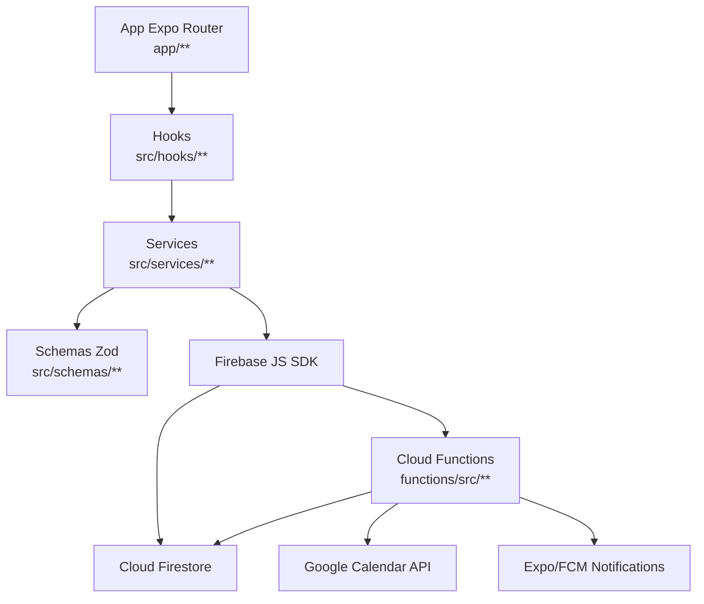

# Plano tecnico - Fase A

Fonte obrigatoria: `docs/sdd-harness/00-contexto-repo.md`.

## 1. Arquitetura em camadas

## 2. Fluxo de dados

Fluxo padrao no app:
- UI em `app/**` chama hooks em `src/hooks/**`.
- Hooks chamam services em `src/services/**`.
- Services validam dados com schemas Zod em `src/schemas/**` quando aplicavel.
- Services acessam Firestore/Firebase Functions via Firebase SDK.
- Functions validam contexto autenticado e executam regras server-side.

Evidencias:
- Rotas: `app/(auth)`, `app/(admin)`, `app/(nail-technician)`, `app/(owner)`.
- Hooks: `src/hooks/**`.
- Services: `src/services/**`.
- Schemas: `src/schemas/**`.
- Functions: `functions/src/**`.

`⚠️ [LACUNA: o contexto nao comprova ausencia total de acesso direto ao Firestore dentro de telas]`.

## 3. Contratos Zod

| Caminho | Contrato |
|---|---|
| `src/schemas/admin/lgpd-export.schema.ts` | Pacote de exportacao LGPD administrativa |
| `src/schemas/appointments/appointment.schema.ts` | Appointment persistido e input de criacao/edicao |
| `src/schemas/appointments/appointment-form.schema.ts` | Formulario de atendimento |
| `src/schemas/audit/audit-log.schema.ts` | Log de auditoria no app |
| `src/schemas/auth/login-form.schema.ts` | Login |
| `src/schemas/auth/recover-form.schema.ts` | Recuperacao de senha |
| `src/schemas/auth/signup-form.schema.ts` | Cadastro |
| `src/schemas/auth/totp.schema.ts` | Payloads/respostas 2FA |
| `src/schemas/clients/client.schema.ts` | Cliente persistido |
| `src/schemas/clients/client-form.schema.ts` | Formulario de cliente |
| `src/schemas/commands/command.schema.ts` | Comanda persistida |
| `src/schemas/commands/command-form.schema.ts` | Formulario de comanda |
| `src/schemas/salons/salon.schema.ts` | Salao |
| `src/schemas/users/user.schema.ts` | Usuario e normalizacao `manicure` -> `nail_technician` |

`⚠️ [LACUNA: o contexto nao comprova que toda callable valida payload com Zod; ha validacoes server-side especificas em functions/src/**]`.

## 4. Modelo de dados

Colecoes reais:
- `salons`
- `users`
- `clients`
- `appointments`
- `commands`
- `notifications`
- `auditLogs`
- `syncQueue`
- `syncQueueDeadLetter`

Campos-chave inferidos por services/rules:
- `salonId`: isolamento multi-salao.
- `userId`: usuario alvo em notificacoes/auditoria/sync.
- `manicureId`: campo legado interno para profissional em agenda/comandas/sync.
- `startTime`, `createdAt`, `timestamp`: ordenacao e consultas.
- `status`, `read`: filtros operacionais.

Indices compostos estao registrados em `firestore.indexes.json` para appointments, clients, commands, notifications, auditLogs, syncQueue e syncQueueDeadLetter.

`⚠️ [DIVERGENCIA: instrucoes citam 8 colecoes oficiais, mas o repositorio tambem usa syncQueueDeadLetter]`.

## 5. Sincronizacao Google Calendar

Estado real:
- OAuth e callables em `functions/src/google/callables.ts`.
- Triggers App -> Google em `functions/src/google/appointment-triggers.ts`.
- Webhook Google -> App em `functions/src/google/watch-webhook.ts`.
- Sync incremental e mapeamento em `functions/src/google/inbound-sync.ts`.
- Fila em `functions/src/google/sync-queue.ts`.
- Renovacao/reconciliacao em `functions/src/google/watch-scheduler.ts`.
- Cliente Google e token crypto em `functions/src/google/calendar-client.ts` e `functions/src/google/token-crypto.ts`.

Tratamento esperado:
- `syncQueue` para tarefas.
- `syncQueueDeadLetter` para falhas.
- `syncToken` e watch channel para sync incremental.
- Last-write-wins documentado como concluido no planejamento.

Lacunas de harness:
- `⚠️ [LACUNA: nao ha teste de integracao/E2E de sync Google -> App]`.
- `⚠️ [LACUNA: nao ha medicao automatizada de sync <10s]`.

## 6. Mapeamento Fase A para Fase B

Fase A:
- Expo/React Native app.
- Firebase Auth, Firestore, Cloud Functions.
- Google Calendar integrado via Functions.

Fase B planejada:
- PostgreSQL + NestJS + Next.js, mantendo app React Native.
- Fonte: `docs/adr/ADR-0001-estrategia-stack-duas-fases.md`, `docs/handoff-fase-b.md`, `docs/nailflow-infraestrutura.md`.

Possiveis migracoes:
- Firestore collections -> tabelas relacionais.
- Cloud Functions -> servicos NestJS/jobs.
- Regras Firestore -> autorizacao backend.
- SyncQueue -> fila/worker dedicado.

## 7. Riscos

| Risco | Estado |
|---|---|
| Migracao Firestore -> PostgreSQL | Divida planejada em ADR-0001 |
| Serverless/cold start | Risco inerente de Functions; deploy real bloqueado por Blaze |
| Blaze pendente | Sem Blaze, Functions de 2FA, Google Calendar, LGPD, triggers e schedulers nao publicam |
| Coverage gradual | Thresholds existem, mas ainda baixos |
| Integracao fora do CI | `pnpm test:integration` existe localmente, mas nao roda no CI |
| E2E parcial | Maestro cobre smoke, nao jornadas completas do piloto |
| Legado `manicure` | Ainda existe em campos internos e compatibilidade de role |
